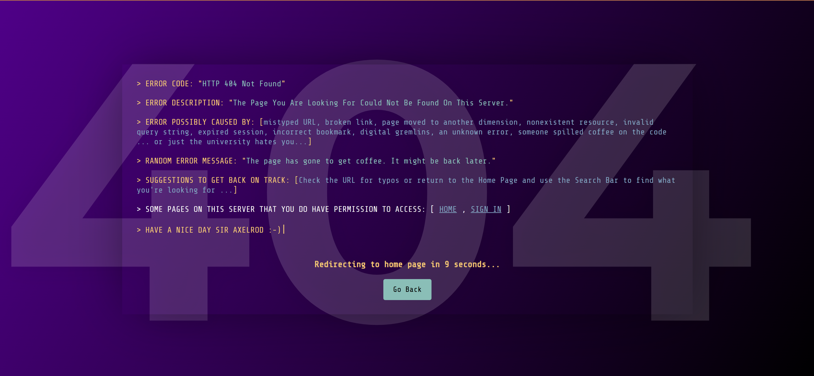

# React 404 Error Page

A stylish and animated 404 error page for React applications with typewriter effect, countdown timer, and a retro terminal look.



## Installation

```
npm install react-404-error-page

# or

yarn add react-404-error-page
```

## Usage

```jsx
import { Error404 } from 'react-404-error-page';
import { Routes, Route } from 'react-router-dom';

function App() {
  return (
    <Routes>
      <Route path="/" element={<HomePage />} />
      {/* Use the Error404 component for any undefined routes */}
      <Route path="*" element={<Error404 />} />
    </Routes>
  );
}

export default App;
```

## Features

- Typewriter effect with terminal-style formatting
- Countdown timer for automatic redirection to home page
- "Go Back" button for manual navigation
- Random error messages for a touch of humor
- Responsive design that works on all screen sizes

## Requirements

This package requires:
- React 19.0.0 or higher (for Hooks support)
- react-router-dom 7.0.0 or higher

## License

ISC